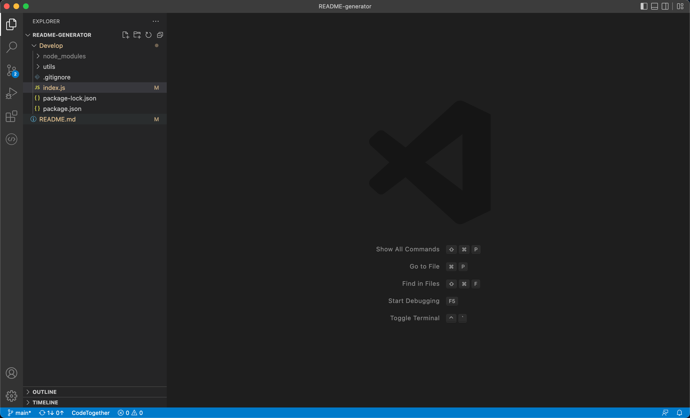
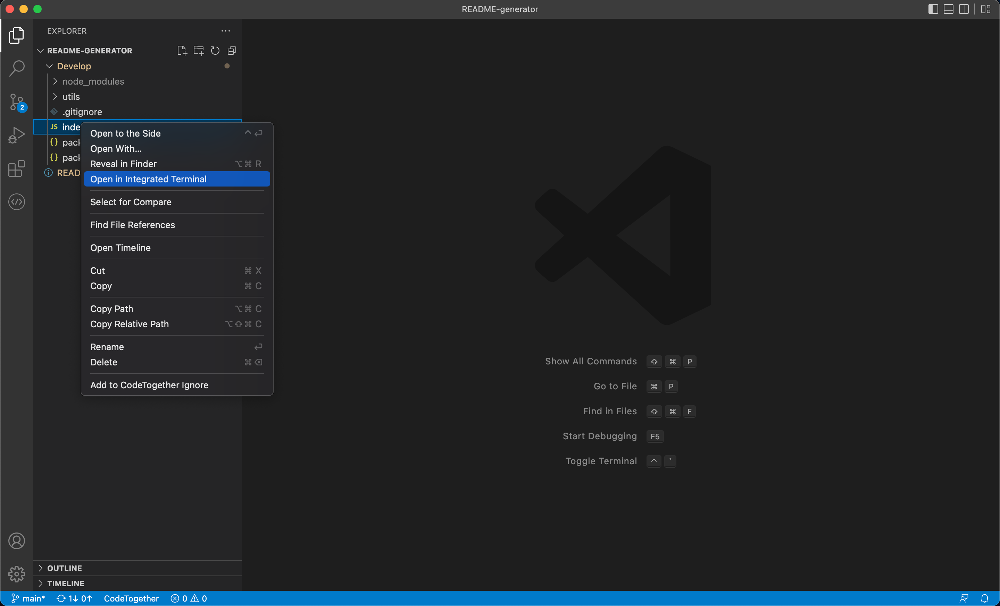
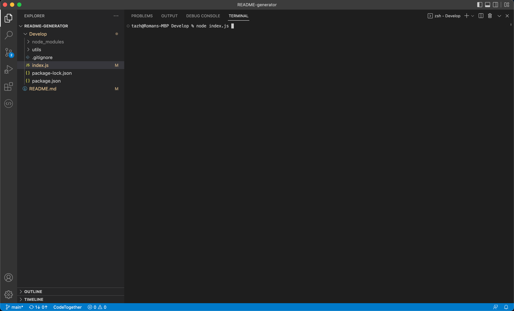
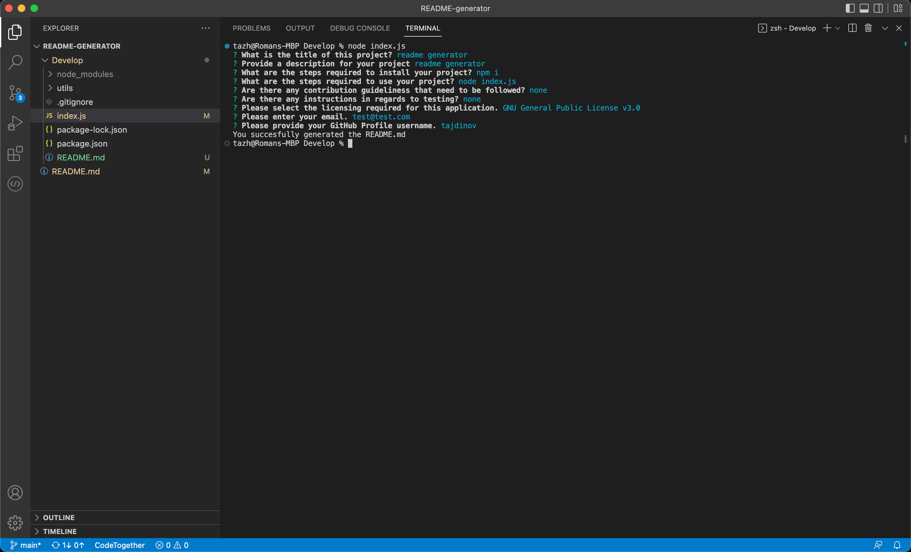

# Read Me Generator

## Description
This project was about creating a read me file generate that would operate using command line application. This was important to do as it was our first time using node and understnainf how it works.

A link to the demo of how the project works can be found here : 
(https://drive.google.com/file/d/150X-3r31M3OSx4Lip07HGnNkhmVxNU3n/view)

To view the code and see how it was created view my GitHUb here: 
(https://github.com/tajdinov/README-generator.git)

## Installation
For the application to sucessful work you must have node.js installed on your computer. 
This can be done by following the link here [download node](https://nodejs.org/en/download/). 
Once node is installed, the next step is to installed inquierer. This is done by opening the terminal and in the command line typing in 'npm init -y' and letting it download. Then in the command line again typing 'npm install inquirer'. 
This will allow the inqurier function to successfully work, i.e. allowing you to answer the questions. 

## Usage
The user opens the command terminal by right clicking and selecting 'Open Integrated Terminal' 

Assuming all installation is done, and the user has Node.Js installed as well as the inquirer package. 

Once in the terminal, type 'node index.js' and hit enter. 

The user will then be presented with a question, which they answer, then another question. The process continues until all questions have been answered. 
Once all questions are answered, the user is presented with a message.

The new file will then be created and have the information the user entered displayed in it. 

## License 
MIT License 

## Features
Node JS  
Inquirer 